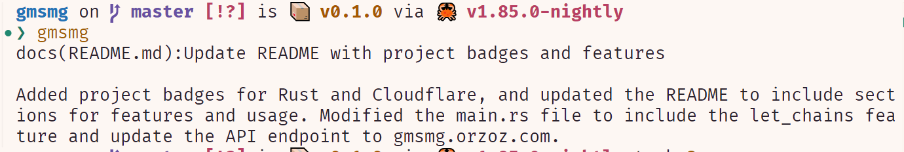

# Gmsmg

Summarize changes in the git repository

## Features
- [x] Straight out of the box.
- [x] Autocopy msg
- [ ] Configurable

## Usage

msg will be copied to clipboard automatically.

## Thanks

- [Cloudflare](https://www.cloudflare.com/) for providing the free tier of their DNS service.