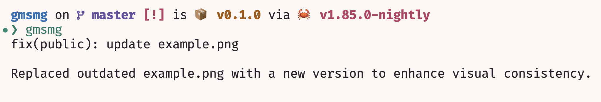

# Gmsmg

Summarize changes in the git repository

## Features
- [x] Straight out of the box.
- [x] Autocopy msg
- [x] Configurable

## Usage

msg will be copied to clipboard automatically.

## Configuration

You can set environment variables to configure.

- `GMSMG_API_BASE`: API base URL. Default is `https://api.github.com`.
- `GMSMG_API_MODEL`: API model. Default is `o1-preview`.
- `GMSMG_API_KEY`: API key. Default is empty.

PS: You are free to use the default configuration to use gmsmg api to create other tools.

## Thanks

- [Cloudflare](https://www.cloudflare.com/) for providing the free tier of their DNS service and free workers.